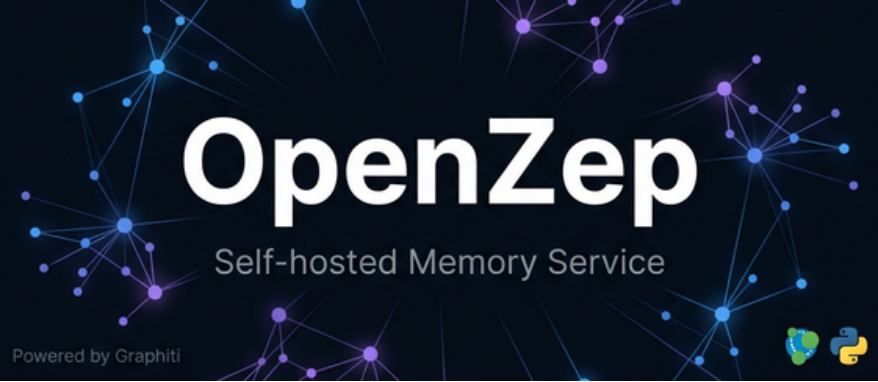
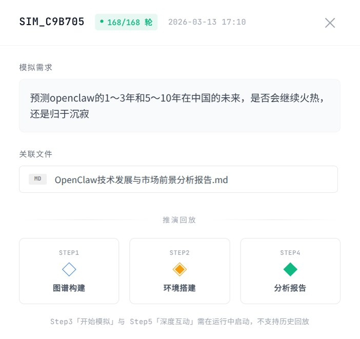
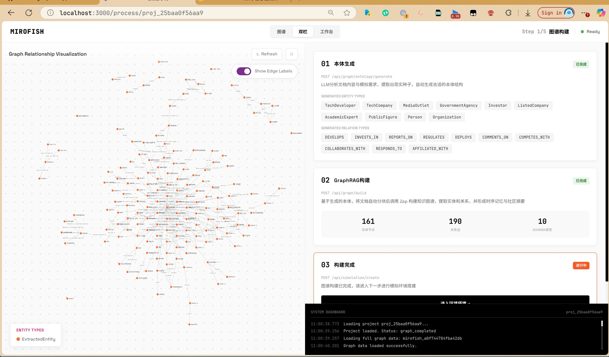
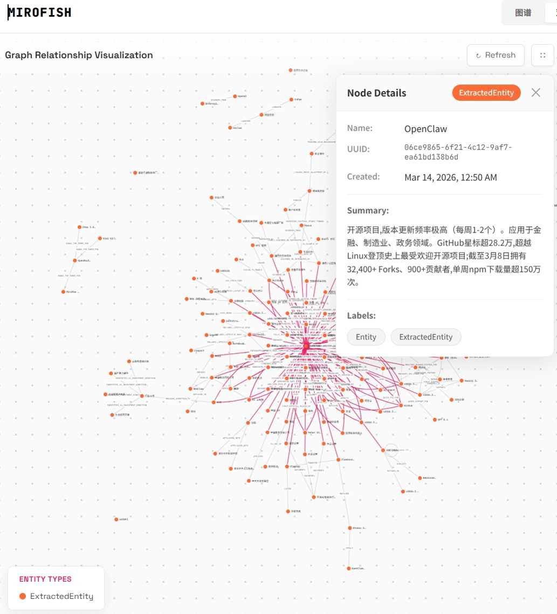
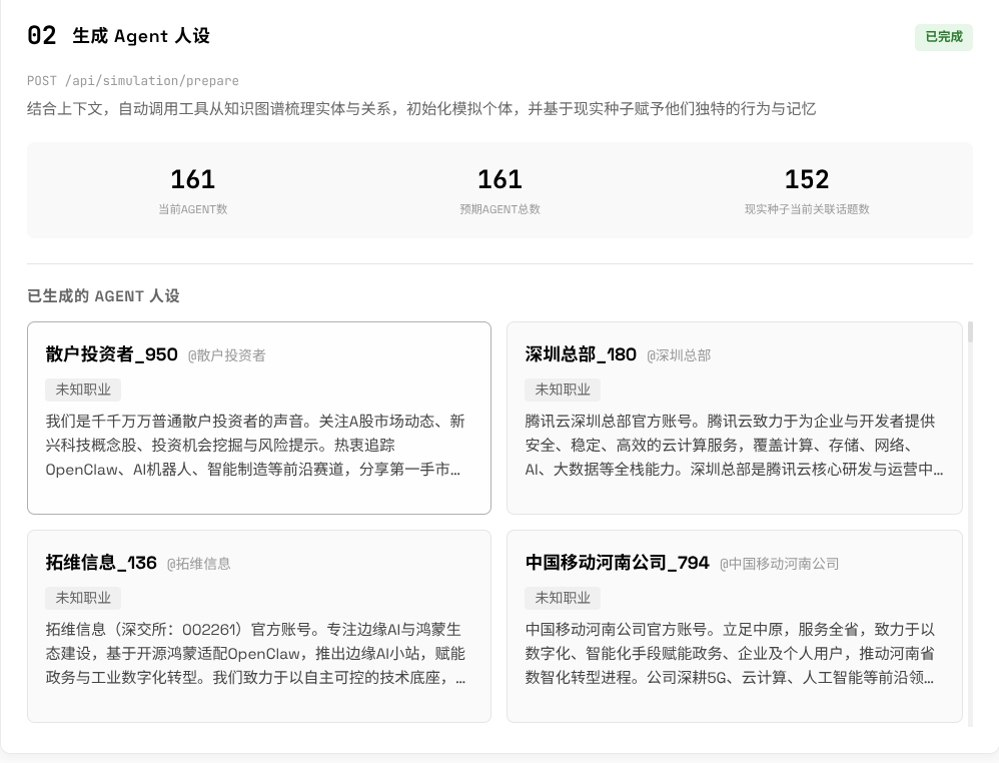
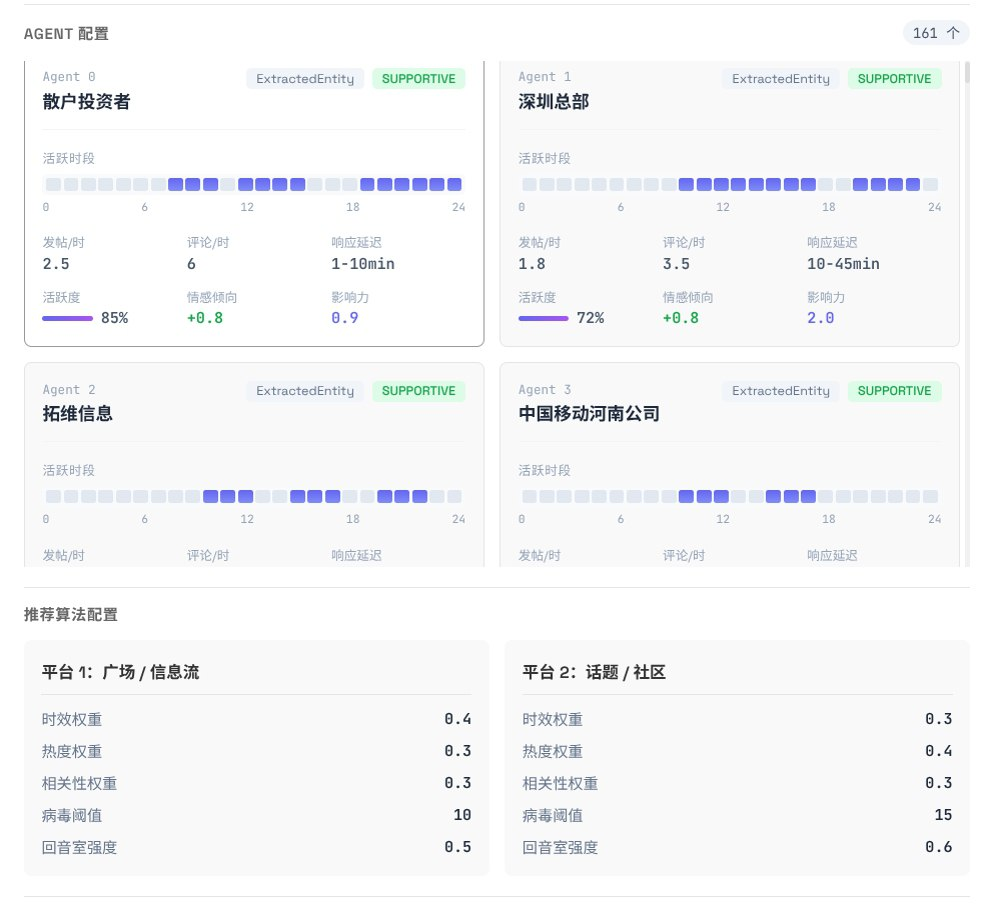
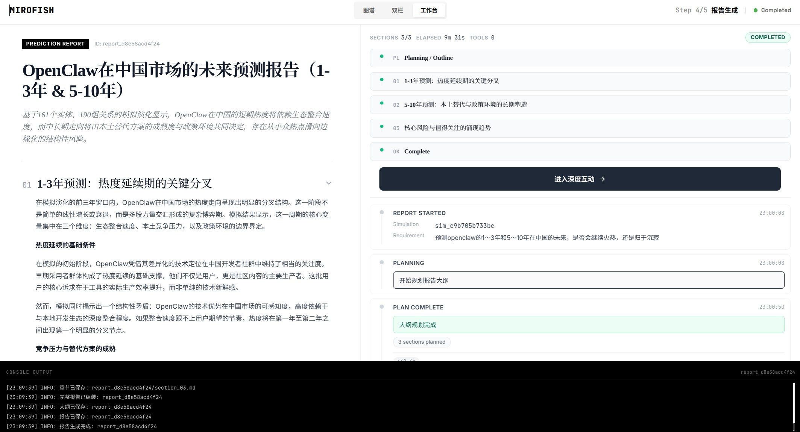
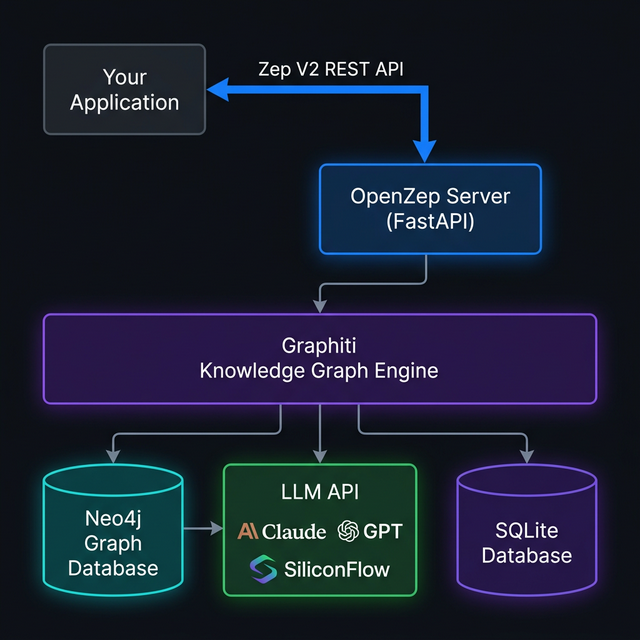

<!-- Banner -->
<div align="center">



# OpenZep

**Self-hosted Zep API-compatible memory service powered by Graphiti knowledge graph.**

[](./LICENSE)
[](https://python.org)
[](https://fastapi.tiangolo.com)
[](https://github.com/getzep/graphiti)
[](https://neo4j.com)

[快速开始](#快速开始) · [API 文档](#api-endpoints) · [配置](#configuration) · [架构](#architecture) · [许可证](#license)

</div>

---

> Zep Cloud 于 2025 年 4 月废弃开源社区版，但大量应用仍依赖 Zep API 格式。
> **OpenZep** 填补这一空白：完全自托管的 Zep API 兼容服务，底层使用 Graphiti 时序知识图谱引擎，支持接入任意 OpenAI 兼容 LLM API。

---

## ✨ 核心特性

- **无缝替换 Zep Cloud** — 已有 Zep 应用零改动迁移，只需修改 endpoint
- **自由选择 LLM** — 支持 Claude、GPT、SiliconFlow、Ollama 等任意 OpenAI 兼容 API
- **完全自托管** — 数据不出本地，无订阅费，无隐私风险
- **真实图谱记忆** — 基于 Graphiti 时序知识图谱，自动提取实体关系，非简单向量检索
- **完整 API 覆盖** — 实现全部 20 个 Zep V2 REST API 端点
- **Docker 一键部署** — 开箱即用

---

## 快速开始

### 前置要求

- Docker & Docker Compose
- 任意 OpenAI 兼容 LLM API Key

### 一键启动

```bash
# 1. 克隆项目
git clone https://github.com/N1nEmAn/openzep.git
cd openzep

# 2. 配置
cp .env.example .env
vim .env  # 填入 LLM_API_KEY / LLM_BASE_URL / LLM_MODEL

# 3. 启动
docker compose up -d

# 4. 验证
curl http://localhost:8000/healthz
# {"status": "ok"}
```

### 最简配置（仅三行）

```env
LLM_API_KEY=your-api-key
LLM_BASE_URL=https://api.siliconflow.cn/v1
LLM_MODEL=Qwen/Qwen2.5-72B-Instruct
```

> **注意**：如果你的 LLM 端点不支持 embedding（如 Anthropic 官方 API），需额外配置 `EMBEDDER_*` 指向支持 embedding 的服务（SiliconFlow、OpenAI 均支持）。

### 接入现有 Zep 应用

```python
from zep_python import ZepClient

client = ZepClient(
    api_key="your-api-key",   # .env 中的 API_KEY，留空则不填
    base_url="http://localhost:8000"
)
```

---

## 实测验证：与 MiroFish 完整集成

OpenZep 已通过与 [MiroFish](https://github.com/666ghj/MiroFish)（多智能体舆论模拟系统）的完整集成测试，验证了全链路兼容性。

### 测试环境

- **openzep** v0.2.0（本次修复版本）
- **mirofish** latest，Docker 部署
- **LLM**：Claude Opus 4.6（通过 OpenAI 兼容接口）
- **Embedder**：BAAI/bge-m3（SiliconFlow）

### 测试流程

1. **图谱构建**：上传 48KB 种子文档，自动提取本体（10种实体类型 + 10种关系类型）
2. **Episode 处理**：异步并行处理 68 个 episode，全部完成
3. **图谱结果**：**161 节点，190 条边**，耗时 966 秒
4. **多智能体模拟**：161 个 Agent 并行运行，Twitter + Reddit 双平台，**168 轮模拟**
5. **总计交互**：**7000+ 次 Agent 行动**
6. **报告生成**：基于模拟数据自动生成结构化预测报告

### 截图

**图谱构建页面**


**图谱可视化（161节点，190边）**


**Simulation 准备阶段（161个Agent人设生成）**


**Simulation 运行中（168轮，Twitter + Reddit双平台）**


**预测报告总览**


**预测报告详细内容**


### 本次修复的关键兼容性问题

| 问题 | 影响 | 修复方案 |
|------|------|----------|
| 仅支持 `Bearer` 鉴权格式 | mirofish 使用 `Api-Key` 格式，鉴权失败 | 同时支持两种格式 |
| episode 同步处理导致超时 | 大批量 episode 处理超时，图谱构建失败 | 改为异步后台 + Semaphore 限流 + 进度轮询 |
| 节点缺少自定义 label | 实体类型过滤返回 0 个实体，模拟无法启动 | 自动补充 `ExtractedEntity` label |
| 空图谱查询抛出异常 | 初始化阶段报错 | 捕获异常返回空列表 |
| `EpisodeResponse` 缺少 `processed` 字段 | mirofish 轮询状态卡死 | 添加 `processed: bool = True` |

---

## Architecture

<div align="center">



</div>

## API Endpoints

### Sessions

| Method | Path | Description |
|--------|------|-------------|
| `POST` | `/api/v2/sessions` | 创建会话 |
| `GET` | `/api/v2/sessions` | 列出所有会话 |
| `POST` | `/api/v2/sessions/search` | 跨会话语义搜索 |
| `GET` | `/api/v2/sessions/{id}` | 获取会话详情 |
| `PATCH` | `/api/v2/sessions/{id}` | 更新会话 metadata |
| `DELETE` | `/api/v2/sessions/{id}` | 删除会话 |

### Memory

| Method | Path | Description |
|--------|------|-------------|
| `POST` | `/api/v2/sessions/{id}/memory` | 添加消息，触发知识图谱更新 |
| `GET` | `/api/v2/sessions/{id}/memory` | 获取记忆上下文（图谱 facts） |
| `DELETE` | `/api/v2/sessions/{id}/memory` | 清空会话记忆 |
| `GET` | `/api/v2/sessions/{id}/messages` | 获取消息历史 |
| `GET` | `/api/v2/sessions/{id}/messages/{uuid}` | 获取单条消息 |
| `PATCH` | `/api/v2/sessions/{id}/messages/{uuid}` | 更新消息 metadata |

### Users

| Method | Path | Description |
|--------|------|-------------|
| `POST` | `/api/v2/users` | 创建用户 |
| `GET` | `/api/v2/users` | 列出所有用户 |
| `GET` | `/api/v2/users/{id}` | 获取用户详情 |
| `PATCH` | `/api/v2/users/{id}` | 更新用户信息 |
| `DELETE` | `/api/v2/users/{id}` | 删除用户 |
| `GET` | `/api/v2/users/{id}/sessions` | 获取用户的所有会话 |

### Facts & Graph

| Method | Path | Description |
|--------|------|-------------|
| `GET` | `/api/v2/facts/{uuid}` | 获取单个知识图谱 fact |
| `DELETE` | `/api/v2/facts/{uuid}` | 删除单个 fact |
| `POST` | `/api/v2/graph/search` | 知识图谱语义搜索 |

交互式 API 文档：`http://localhost:8000/docs`

---

## Configuration

所有配置通过环境变量（`.env` 文件）控制：

```env
# LLM（必填）
LLM_API_KEY=your-api-key
LLM_BASE_URL=https://api.siliconflow.cn/v1
LLM_MODEL=Qwen/Qwen2.5-72B-Instruct
LLM_SMALL_MODEL=Qwen/Qwen2.5-7B-Instruct    # 可选，用于轻量任务

# Embedder（可选，留空则复用 LLM 配置）
# EMBEDDER_API_KEY=
# EMBEDDER_BASE_URL=
EMBEDDER_MODEL=BAAI/bge-m3

# Neo4j
NEO4J_URI=bolt://neo4j:7687
NEO4J_USER=neo4j
NEO4J_PASSWORD=your-password

# OpenZep API Key（可选，留空则禁用认证）
API_KEY=your-openzep-api-key
```

### 常见 LLM 提供商配置示例

**SiliconFlow（推荐，支持 embedding）**
```env
LLM_API_KEY=sk-xxx
LLM_BASE_URL=https://api.siliconflow.cn/v1
LLM_MODEL=Qwen/Qwen2.5-72B-Instruct
EMBEDDER_MODEL=BAAI/bge-m3
```

**OpenAI**
```env
LLM_API_KEY=sk-xxx
LLM_BASE_URL=https://api.openai.com/v1
LLM_MODEL=gpt-4o
EMBEDDER_MODEL=text-embedding-3-small
```

**本地 Ollama**
```env
LLM_API_KEY=ollama
LLM_BASE_URL=http://localhost:11434/v1
LLM_MODEL=llama3.1:8b
EMBEDDER_MODEL=nomic-embed-text
```

**Anthropic / 不支持 embedding 的 LLM**

如果你的 LLM 端点不提供 embedding（如 Anthropic 官方 API、部分本地代理），需单独配置 Embedder：

```env
# LLM 用 Anthropic 兼容代理
LLM_API_KEY=your-llm-key
LLM_BASE_URL=http://your-proxy/v1
LLM_MODEL=anthropic/claude-sonnet-4.6

# Embedder 单独指向支持 embedding 的服务（SiliconFlow / OpenAI 均可）
EMBEDDER_API_KEY=sk-xxx
EMBEDDER_BASE_URL=https://api.siliconflow.cn/v1
EMBEDDER_MODEL=BAAI/bge-m3
```

---

## 本地开发

```bash
# 1. 启动 Neo4j
docker run -d --name neo4j --restart unless-stopped \
  -p 7687:7687 -p 7474:7474 \
  -e NEO4J_AUTH=neo4j/password123 neo4j:5

# 2. 配置环境变量
cp .env.example .env
vim .env  # 填入 LLM_API_KEY / LLM_BASE_URL / LLM_MODEL

# 3. 安装依赖
python3 -m venv .venv
source .venv/bin/activate
pip install -r requirements.txt

# 4. 启动开发服务器
uvicorn main:app --reload

# 或后台运行
nohup .venv/bin/uvicorn main:app --host 0.0.0.0 --port 8000 > openzep.log 2>&1 &
```

> **启动时的索引报错**：首次启动或 Neo4j 容器已存在数据时，日志中会出现 `EquivalentSchemaRuleAlreadyExists` 错误，这是 graphiti-core 在 Neo4j 5 上重复创建索引时的已知行为，**不影响服务正常运行**，可忽略。

> **uvicorn 找不到**：如果直接运行 `uvicorn` 提示 command not found，请确保已激活 venv（`source .venv/bin/activate`），或使用完整路径 `.venv/bin/uvicorn`。

---

## Star History

[](https://www.star-history.com/?repos=N1nEmAn%2Fopenzep&type=date&legend=top-left)

---

## License

Copyright © 2026 [N1nEmAn](https://github.com/N1nEmAn). All rights reserved.

This software is licensed under the **OpenZep Proprietary License**. See [LICENSE](./LICENSE) for full terms.

**Summary:**
- The original author (N1nEmAn) retains exclusive commercial rights
- You may use this software for personal, non-commercial purposes
- Any redistribution, fork, or derivative work must clearly credit the original author
- Commercial use by third parties requires written permission from the author
- See [LICENSE](./LICENSE) for complete terms

---

<div align="center">

Made with by [N1nEmAn](https://github.com/N1nEmAn)

**OpenZep** — *Memory that thinks, not just remembers.*

</div>
