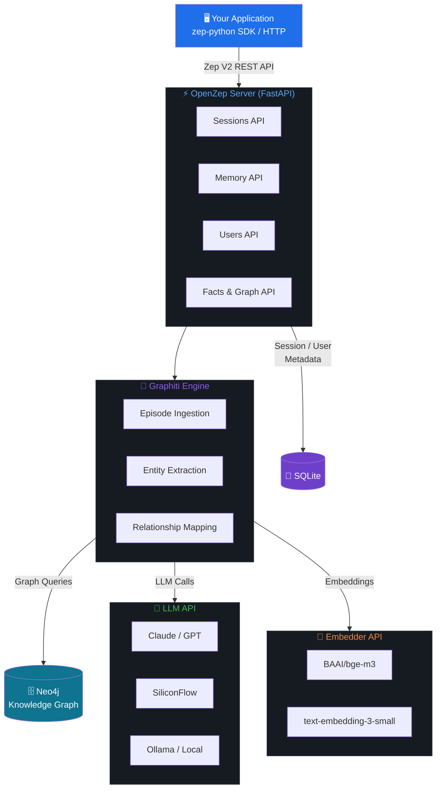

# OpenZep — Image Generation Prompts

这些提示词用于生成 README 所需的图片资源。
生成后将图片保存到 `docs/` 目录：`banner.png` 和 `architecture.png`。

---

## Banner 图 (`docs/banner.png`)

**推荐尺寸**: 1200 × 400px
**推荐工具**: Midjourney / DALL·E 3 / Stable Diffusion

### Prompt（英文）

```
A sleek, dark-themed technology banner for an open-source software project called "OpenZep".
Centered bold white text "OpenZep" in a modern sans-serif font.
Subtitle below: "Self-hosted Memory Service" in smaller gray text.
Background: deep dark navy (#0d1117) with subtle glowing knowledge graph neural network nodes
and edges radiating outward from center — interconnected dots and lines in electric blue (#58a6ff)
and soft purple (#8b5cf6), like synapses or constellation maps.
Bottom left: small text "Powered by Graphiti" in muted gray.
Bottom right: small icons representing Neo4j graph database and Python.
Overall aesthetic: minimalist, professional, sci-fi tech feel — similar to GitHub dark mode project banners.
Aspect ratio 3:1, ultra-wide banner format.
```

### Prompt（中文版，适合国内工具）

```
深色科技风格横幅图，项目名称「OpenZep」居中，现代无衬线白色粗体字。
副标题「Self-hosted Memory Service」浅灰色小字。
背景为深海军蓝(#0d1117)，中央向外辐射发光的知识图谱节点和边，
电蓝色(#58a6ff)与柔紫色(#8b5cf6)的互联点线，如突触或星座图。
左下角「Powered by Graphiti」灰色小字，右下角 Neo4j 和 Python 图标。
极简、专业、科幻技术感，类似 GitHub 暗色模式项目 banner。
3:1 超宽横幅比例，1200×400 像素。
```

---

## 架构图 (`docs/architecture.png`)

**推荐尺寸**: 1200 × 800px
**推荐工具**: Excalidraw / draw.io / Mermaid / Midjourney

### Mermaid 代码（可直接渲染）



### AI 生成提示词（Midjourney / DALL·E）

```
A clean, dark-themed software architecture diagram for "OpenZep" memory service.
Top layer: application box labeled "Your Application" connected via arrow labeled "Zep V2 REST API"
to a central server box "OpenZep Server (FastAPI)" in electric blue.
Middle layer: the server connects to a "Graphiti Knowledge Graph Engine" box in purple.
Bottom layer: three connected components —
  1. Neo4j graph database cylinder (teal/cyan),
  2. LLM API box showing Claude/GPT/SiliconFlow logos (green),
  3. SQLite database cylinder (purple).
Arrows show data flow direction. Dark background #0d1117.
Minimalist, technical, GitHub-style dark diagram. Clean sans-serif labels.
1200x800px, landscape orientation.
```

---

## 生成建议

| 工具 | Banner | 架构图 |
|------|--------|--------|
| **Midjourney** | 最佳视觉效果 | 可用但需调整 |
| **DALL·E 3** | 效果好 | 中等 |
| **Excalidraw** | 不适合 | **推荐**，手绘风格 |
| **draw.io** | 不适合 | **推荐**，专业图表 |
| **Mermaid** | 不适合 | 直接复制上方代码渲染 |

### Mermaid 在线渲染

访问 https://mermaid.live/ 粘贴上方 Mermaid 代码即可生成架构图，
导出为 PNG 后保存至 `docs/architecture.png`。
